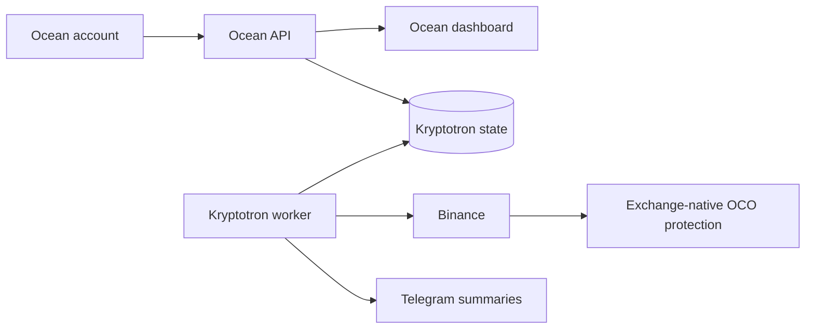

# OCEAN

Ocean is a private-alpha digital control center built around one principle: complex automation should feel calm, legible and safe.

Its first application, **Kryptotron**, connects an authenticated Ocean account to a remotely running Binance worker. The dashboard exposes live balance, positions, exchange-native protection, operating state and a concise event log without leaking infrastructure credentials to the browser.

> This repository is a portfolio and educational project. It is not investment advice, a managed investment service or a promise of returns. Cryptocurrency trading can result in substantial loss.

## Product structure



Ocean is the platform. Kryptotron is the first application. Arcade and Vault are deliberately inactive placeholders for future product directions.

## Current capabilities

- opaque internal user identities independent of email and username;
- Argon2id password hashing and server-side sessions;
- hashed verification, recovery and session tokens;
- login timing protection for unknown accounts;
- rate limiting, security headers and origin validation;
- live Kryptotron balance, position, protection and health data;
- safe pause/resume control affecting new entries only;
- restart-safe buy intents with stable Binance client order IDs;
- exchange-native OCO protection and reconciliation after restarts;
- daily and weekly risk limits;
- Telegram summaries using the Europe/Prague timezone;
- compact on-dashboard event log;
- automated TypeScript and Python tests.

## Repository layout

```text
Ocean/
├── src/                    Fastify server, authentication and API
├── public/                 dependency-free dashboard UI
├── test/                   web and integration-contract tests
└── services/kryptotron/    Binance worker and safety tests
```

## Local development

Requirements: Node.js 22+, npm and Python 3.12+.

```bash
npm ci
cp .env.example .env
npm run dev
```

Ocean starts at `http://localhost:3000`. Local development uses SQLite and a development-only mailbox for verification and password recovery messages.

Run the web checks:

```bash
npm test
npm run typecheck
npm run build
```

Run the worker checks without exchange credentials:

```bash
python -m unittest discover -s services/kryptotron/tests -v
```

See [services/kryptotron/README.md](services/kryptotron/README.md) for worker architecture and safe configuration.

## Security model

Secrets are accepted only through environment variables. The browser talks to the Ocean API; it never receives Binance credentials or the privileged Supabase key. Binance API keys should have withdrawals disabled and be restricted to the worker's egress IP.

The current release intentionally binds one configured Ocean user ID to one Kryptotron state. It is a single-user vertical slice, not yet a multi-tenant trading platform. A production multi-user version requires isolated bot instances, per-user ownership, versioned commands, database migrations and reviewed Row Level Security policies.

Do not commit `.env`, SQLite databases, runtime state, logs, API keys, Telegram tokens or production screenshots containing identifiers.

## Project status

Ocean is a working private alpha. The execution safety mechanisms are tested, but the trading strategy has not yet been validated by a reproducible backtest with fees, slippage and out-of-sample data. Use testnet or paper trading for experimentation.

## License

No license is currently granted. The source is published for portfolio review. Please contact the author before reuse or redistribution.
